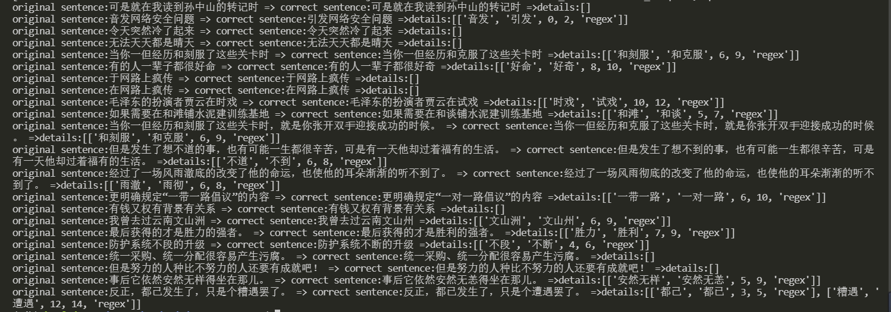

# ESCorrector
基于ES的文本校对方法

## 环境准备
1、安装python3.6

2、安装好ElasticSearch-6.5.4

## 运行流程
- 启动elasticsearch，启动方式见网上教程
- 执行[es_utils.py](./utils/es_utils.py)文件，程序会使用ES创建索引，并将相关语料喂给索引，后面可自动扩展语料，txt文本或docx文档均可以
- 语料索引构建完成后，再执行[corrector_regex.py](./escorrector/corrector_regex.py)文件,完成校对，目前语料规模太小，校对效果还有待提升
